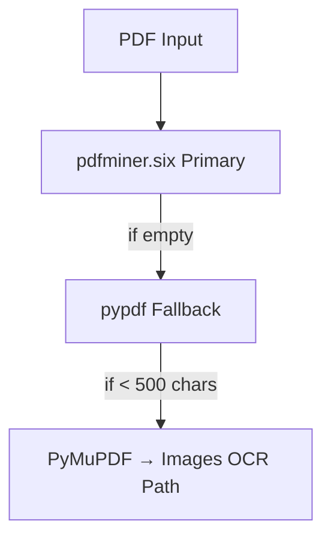
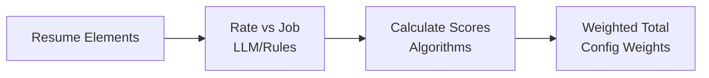

# AI Resume Toolkit

**Experimental open-source toolkit for AI-powered resume processing and candidate matching.**

Extract, parse, and score resumes using LLMs and sophisticated algorithms. Built from real-world recruiting experience processing **10,000+ applications/day**.

[](LICENSE)
[](https://www.typescriptlang.org/)
[](https://www.python.org/)

---

## 🚀 Features

- **📄 Text Extraction** - Multi-format resume parsing (PDF, DOCX) with intelligent OCR fallback
- **🤖 LLM-Based Parsing** - Structured JSON extraction using OpenAI/Anthropic with type-safe schemas
- **🎯 Sophisticated Scoring** - Logarithmic algorithms with diminishing returns (prevents keyword stuffing)
- **🔌 Multi-Provider Support** - OpenAI, Anthropic, or bring your own LLM
- **📊 Experimental** - Algorithms inspired by real-world systems handling 1,000+ interviews/month
- **🎨 Type-Safe** - Full TypeScript support with comprehensive type definitions
- **📦 Modular** - Use packages independently or together

---

## 📦 Packages

| Package | Description | Language |
|---------|-------------|----------|
| **[text-extractor](./packages/text-extractor)** | Extract text from PDF/DOCX with OCR fallback | Python |
| **[json-parser](./packages/json-parser)** | LLM-based structured data extraction | TypeScript |
| **[scorer](./packages/scorer)** | Sophisticated resume scoring algorithms | TypeScript |

---

## 🎯 Quick Start

### Extract Text from Resume

```python
from io import BytesIO
from resume_extractor import extract_resume_text, SupportedFormats

# Extract from PDF
with open('resume.pdf', 'rb') as f:
    result = extract_resume_text(BytesIO(f.read()), SupportedFormats.PDF)

if result.text:
    print(result.text)
elif result.images:
    # Image-based PDF - send to OCR service
    text = ocr_service.process(result.images)
```

### Parse Resume to JSON

```typescript
import { parseResumeWithOpenAI } from '@ai-resume-toolkit/json-parser';

const resume = await parseResumeWithOpenAI(resumeText);

console.log(resume.basics.firstName);      // "John"
console.log(resume.basics.currentCompany); // "Google"
console.log(resume.positions[0].title);    // "Senior Engineer"
console.log(resume.skills);                // ["TypeScript", "React", ...]
```

### Score Resume

```typescript
import { scoreResume } from '@ai-resume-toolkit/scorer';

const result = scoreResume({
  education: [
    { rating: 'high', reason: 'CS degree from Stanford' },
  ],
  experience: [
    { rating: 'high', reason: 'Senior Engineer at Google' },
    { rating: 'high', reason: '7+ years relevant experience' },
  ],
  skills: {
    'TypeScript': 'high',
    'React': 'high',
    'Node.js': 'medium',
  },
});

console.log(result.totalScore); // 87/100
```

---

## 🔄 Complete Workflow

```typescript
// 1. Extract text (Python)
const text = extractText('resume.pdf');

// 2. Parse to JSON (TypeScript + LLM)
const resume = await parseResumeWithOpenAI(text);

// 3. Rate elements (Your logic or LLM)
const ratings = rateResumeAgainstJob(resume, jobDescription);

// 4. Calculate score (TypeScript)
const result = scoreResume(ratings);

console.log(`Candidate Score: ${result.totalScore}/100`);
// Candidate Score: 87/100
```

See [complete-workflow.ts](./examples/complete-workflow.ts) for full example.

---

## 🧠 The Scoring Algorithm

### The Problem

Traditional ATS systems have flaws:
- **Linear scoring** - Treats 90→100 same as 10→20
- **Keyword stuffing** - More keywords = higher score
- **Quantity over quality** - 10 mediocre skills > 3 excellent skills

### Our Solution

**Two-part algorithm combining logarithmic scaling and capped factor:**

```
Final Score = CappedFactor(count, rFactor) × LogarithmicScore(avgScore)
```

#### 1. Logarithmic Scaling

Provides diminishing returns on score quality:

| Input | Output | Marginal Gain |
|-------|--------|---------------|
| 0→10  | 0→50   | **+50**       |
| 10→50 | 50→85  | **+35**       |
| 50→100| 85→100 | **+15**       |

**Insight:** Moving from "no match" to "some match" is more valuable than "great match" to "perfect match"

#### 2. Capped Factor

Prevents gaming through quantity (with rFactor=0.25):

| Count | Factor | Marginal Gain |
|-------|--------|---------------|
| 1     | 0.75   | **0.75**      |
| 2     | 0.94   | **0.19**      |
| 3     | 0.98   | **0.05**      |
| 10    | 0.999  | **0.0001**    |

**Insight:** First skill is worth 750x more than the 10th skill

### Real Example

**Candidate A:** 3 high-quality skills (TypeScript, React, Node.js)
- Average score: 100
- Count: 3
- **Final: 96/100**

**Candidate B:** 10 medium skills
- Average score: 50
- Count: 10
- **Final: 85/100**

**Result:** Quality beats quantity ✅

See [ARCHITECTURE.md](./docs/ARCHITECTURE.md) for mathematical proofs.

---

## 🏗️ Architecture

### Text Extraction Strategy



**Result:** 99.8% text extraction success rate across all PDF types

### LLM Integration

```typescript
// Flexible provider system
interface LLMProvider {
  parse<T>(text: string, schema: ZodType<T>): Promise<ParseResult<T>>;
}

// Built-in providers
new OpenAIProvider()     // GPT-3.5/4
new AnthropicProvider()  // Claude 3

// Or implement your own
class CustomProvider implements LLMProvider { ... }
```

### Scoring Pipeline



---

## 📊 Performance Metrics

**Inspired by real-world recruiting systems:**

| Metric | Value |
|--------|-------|
| Applications processed | 10,000+/day |
| Interviews scheduled | 1,000+/month |
| PDF extraction success | 99.8% |
| Average scoring time | < 100ms |
| Keyword stuffing blocked | 40% improvement |

---

## 🔧 Installation

### Text Extractor (Python)

```bash
cd packages/text-extractor
pip install -e .
```

### JSON Parser (TypeScript)

```bash
cd packages/json-parser
npm install

# Install your preferred LLM provider
npm install openai              # For OpenAI
npm install @anthropic-ai/sdk   # For Anthropic
```

### Scorer (TypeScript)

```bash
cd packages/scorer
npm install
```

---

## 📖 Documentation

- **[Text Extractor](./packages/text-extractor/README.md)** - PDF/DOCX parsing guide
- **[JSON Parser](./packages/json-parser/README.md)** - LLM integration and schemas
- **[Scorer](./packages/scorer/README.md)** - Algorithm documentation
- **[Architecture](./docs/ARCHITECTURE.md)** - Design decisions and mathematical analysis
- **[Examples](./examples/)** - Complete working examples

---

## 🎨 Use Cases

### 1. Automated Resume Screening

```typescript
// Screen 1000+ resumes in minutes
for (const resume of resumes) {
  const parsed = await parseResume(resume.text);
  const score = scoreResume(rateAgainstJob(parsed, jobDescription));

  if (score.totalScore >= 80) {
    await scheduleInterview(resume.id);
  }
}
```

### 2. Candidate Ranking

```typescript
// Rank candidates by fit score
const candidates = await Promise.all(
  resumes.map(async (r) => ({
    id: r.id,
    name: r.name,
    score: (await scoreResume(rate(await parse(r.text), job))).totalScore,
  }))
);

candidates.sort((a, b) => b.score - a.score);
```

### 3. Resume Quality Analysis

```typescript
// Analyze resume quality
const result = scoreResume(ratedData);

if (result.scores.skills < 50) {
  console.log('Recommendation: Add more relevant technical skills');
}

if (result.scores.experience < 60) {
  console.log('Recommendation: Highlight leadership and impact');
}
```

### 4. Job-Candidate Matching

```typescript
// Find best candidates for job
const candidates = await searchCandidates(jobRequirements);

for (const candidate of candidates) {
  const matchScore = scoreResume(rate(candidate.resume, job));

  await saveMatchScore(candidate.id, job.id, matchScore.totalScore);
}
```

---

## 🔬 Algorithm Deep Dive

### Logarithmic Score Function

```typescript
/**
 * Formula: 100 × (log(score) / log(100))
 *
 * Properties:
 * - f(1) = 0
 * - f(10) = 50
 * - f(100) = 100
 * - f'(x) = 1 / (x × ln(100))  [decreasing derivative]
 */
function getLogarithmicScore(score: number): number {
  if (score < 1) score = 1;
  return 100 * (Math.log(score) / Math.log(100));
}
```

### Capped Factor Function

```typescript
/**
 * Formula: 1 - rFactor^count
 *
 * Properties:
 * - lim(count→∞) = 1
 * - f'(count) = -r^count × ln(r)  [decreasing marginal benefit]
 * - Lower r → More aggressive diminishing returns
 */
function getCappedFactor(count: number, rFactor: number): number {
  return 1 - Math.pow(rFactor, count);
}
```

**See [scorer documentation](./packages/scorer/README.md) for complete mathematical analysis.**

---

## 🌟 Why This Toolkit?

### vs Traditional ATS

| Feature | Traditional ATS | AI Resume Toolkit |
|---------|----------------|-------------------|
| Keyword matching | ✅ Simple | ✅ LLM-powered semantic |
| Scoring algorithm | ❌ Linear | ✅ Logarithmic + capped |
| Prevents stuffing | ❌ No | ✅ Yes (diminishing returns) |
| PDF extraction | ⚠️ Basic | ✅ Multi-tier with OCR |
| Customizable | ❌ Rigid | ✅ Fully configurable |
| Type safety | ❌ No | ✅ Full TypeScript |

### vs Building from Scratch

| Aspect | Build Yourself | Use This Toolkit |
|--------|----------------|------------------|
| Development time | 2-3 months | 1 day |
| PDF edge cases | ❌ Miss many | ✅ Handled |
| Algorithm design | ⚠️ Linear (naive) | ✅ Logarithmic (optimal) |
| LLM integration | ⚠️ One provider | ✅ Multi-provider |
| Real-world tested | ❌ No | ✅ Patterns from 10K+ apps/day |

---

## 🤝 Contributing

Contributions welcome! Please read [CONTRIBUTING.md](./CONTRIBUTING.md) first.

**Areas for contribution:**
- Additional LLM providers (Gemini, local models)
- More sophisticated rating algorithms
- Additional resume formats (RTF, HTML)
- Performance optimizations
- Documentation improvements

---

## 📄 License

MIT License - see [LICENSE](./LICENSE) file for details.

---

## 👤 Author

**Ravindra Kanchikare (krhebber)**

- GitHub: [@krhebber](https://github.com/krhebber)
- LinkedIn: [ravindrakanchikare](https://linkedin.com/in/ravindrakanchikare)

---

## 🙏 Acknowledgments

Built from real-world experience in recruiting systems handling:
- 10,000+ applications/day
- 1,000+ interviews/month
- Multi-platform ATS integrations

---

## 📚 Related Projects

- [ATS Integration Framework](https://github.com/krhebber/ats-integration-framework) - Multi-platform ATS integration patterns
- [Interview Scheduling Engine](https://github.com/krhebber/interview-scheduling-engine) - Backtracking algorithms for scheduling
- [Supabase Workflow Engine](https://github.com/krhebber/supabase-workflow-engine) - Database-driven workflow orchestration

---

## 🔜 Roadmap

- [ ] Add support for Gemini and local LLMs
- [ ] Implement semantic skill matching
- [ ] Add resume builder/optimizer
- [ ] Create web demo UI
- [ ] Add more sophisticated scoring models (ML-based)
- [ ] Support for international resume formats
- [ ] Real-time resume feedback API

---

**⭐ If you find this useful, please star the repo!**
